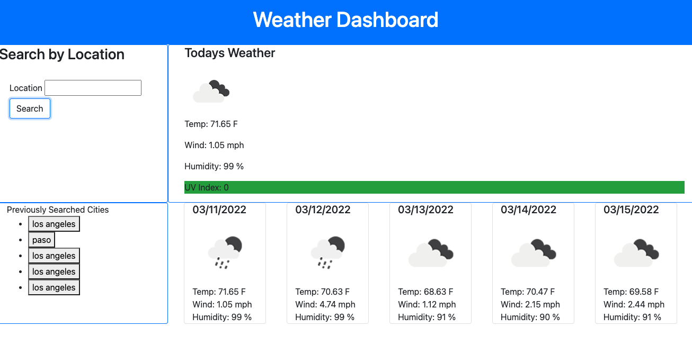

# Weather Dashboard

## Description
This is an application that allows users to search for the weather by city name. It provides the UV Index, Temperature, Humidity, and Wind Speed for today, and a forecast of weather for the next 5 days. 

Users can see their previously searched cities and click on them to preview the weather again. 

## Technologies
* javascript
* css/bootstrap
* openweathermap api

## Contributors
* Adam Burpee: [github](https://github.com/aburpee/weather-dashboard)

## Link
https://aburpee.github.io/weather-dashboard/